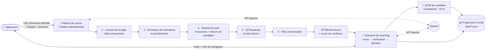

<div align="center">

# 🎓 My AI Certification Coach

**Un coach IA qui transforme n'importe quelle page d'examen officielle en plan d'étude personnalisé — à la voix comme à l'écrit.**

[English](README.md) · [Français](README.fr.md)

[](LICENSE)
[](https://nodejs.org)
[](https://platform.openai.com)
[](#-comment-ça-marche)
[](#-fonctionnalités-clés)
[](package.json)
[](#-contribuer)
[](https://github.com/careerpmo-max/My-AI-Certification-Coach/actions/workflows/ci.yml)

</div>

---

Préparer une certification, c'est long, dispersé sur une dizaine d'onglets et impersonnel.
**My AI Certification Coach** lit la page d'examen officielle que tu lui donnes, en extrait les domaines et leurs pondérations, construit un plan adapté à ton niveau, puis enseigne chaque module en conversation — écrite ou parlée.
Résultat : un cours structuré, un suivi de progression par domaine et des QCM de synthèse, le tout sur ta machine avec une seule clé OpenAI.

## ✨ Fonctionnalités clés

| | Fonctionnalité | Ce que ça fait |
|---|---|---|
| 🌐 | **Moteur générique multi-certifications** | Donne l'URL de la page d'examen officielle (toute page https publique). Les domaines et pondérations sont extraits ; chaque domaine extrait doit figurer textuellement dans la page. Une suggestion intégrée existe pour Microsoft AI-103. |
| 🧾 | **Débrief sourcé + score de confiance** | Un score déterministe sur 100, avec ses raisons (page lue, date trouvée, pondérations cohérentes, ressources et retours trouvés…) et les sources citées. Les sites de « dumps » d'examens sont exclus volontairement. |
| 🧭 | **Évaluation de niveau et programme personnalisé** | Diagnostic facultatif (une question par domaine + auto-évaluation, détection de surconfiance). Le plan suit les pondérations officielles ; un plan de secours déterministe prend le relais si la sortie du modèle est invalide. |
| 📊 | **Progression par domaine** | Cercles de progression par module, avancement par domaine et global pondéré, barre qui ne recule jamais. |
| 📝 | **QCM de fin de module** | 8 questions originales au format examen (choix unique et multiple), seuil de réussite 70 %, lacunes enregistrées en cas d'erreur. |
| ▶️ | **Reprise exacte de session** | Le coach mémorise ta position, ta phase et tes lacunes ouvertes (« Reprise : … » à ton retour). |
| 🎙️ | **Voix + texte simultanés** | Web Speech API native du navigateur : aucun token vocal facturé par OpenAI. Chrome, Edge ou Safari. |
| 🧑‍🏫 | **3 personas de coach** | **Lumen** (bienveillante), **Vera** (exigeante), **Eko** (énergique), chacun avec ses réglages de voix. |
| 🌍 | **Formation en 3 langues** | Français, anglais, espagnol. La langue est figée par cursus et pilote le coach, les QCM, l'interface et la voix. [En ajouter une](docs/ADD_A_LANGUAGE.md). |
| 🔒 | **Données locales** | Profil, clé API, cursus et conversations sont des fichiers JSON dans `data/`, sur ta machine. |
| 🩺 | **Commande `doctor`** | `npm run doctor` exerce chaque appel API sensible avec ta clé et indique quoi corriger. |
| 💸 | **Compteur d'usage** | Appels API, tokens et coût estimé sous la zone de saisie (tarifs indicatifs, modifiables). |

## 🖼️ Aperçu

<!--
  Ajoute des captures dans docs/screenshots/ puis décommente :

  
  
  
  
-->

> 📸 *Captures d'écran à venir — emplacements prévus dans `docs/screenshots/` (accueil, création de cursus, espace de coaching, QCM de synthèse).*

### Architecture



## 🚀 Démarrage rapide

**1. Prérequis** — [Node.js ≥ 22](https://nodejs.org) (la CI teste Node 22 et 24 sous Linux, macOS et Windows) et une [clé API OpenAI](https://platform.openai.com/api-keys). **Pas de `npm install`** : zéro dépendance.

```sh
node --version   # v22.x ou supérieur
```

**2. Clonage**

```sh
git clone https://github.com/careerpmo-max/My-AI-Certification-Coach.git
cd My-AI-Certification-Coach
```

**3. Configuration (facultative)** — ta clé API se saisit dans l'écran d'onboarding de l'application ; `.env` ne sert donc qu'à changer les valeurs par défaut ou à lancer `npm run doctor` sans onboarding. L'application ne charge pas `.env` d'elle-même ; utilise l'option `--env-file` de Node :

```sh
cp .env.example .env        # puis édite .env
node --env-file=.env src/server/index.js
```

**4. Lancement**

```sh
npm start                   # ou ./start.sh (macOS/Linux) · start.bat (Windows)
```

Ouvre <http://127.0.0.1:3210> (`start.sh` / `start.bat` l'ouvrent pour toi). Le serveur n'écoute que sur ta machine.

> ℹ️ Au premier démarrage, l'application crée un **raccourci bureau « Coach IA »** (une seule fois, marqueur `data/.shortcut-done`). `COACH_NO_SHORTCUT=1` l'évite.

**5. Vérification** (quelques centimes d'API)

```sh
npm run doctor
```

**6. Première session** — termine l'onboarding (prénom, clé API, coach), choisis **Nouveau cursus**, colle l'URL de la page d'examen officielle, choisis la langue de formation, puis clique sur **Démarrer avec le coach**.

## ⚙️ Configuration

Toutes les variables sont facultatives. La clé OpenAI se saisit dans l'application.

| Variable | Obligatoire | Description | Défaut |
|---|---|---|---|
| `OPENAI_API_KEY` | Non | Utilisée uniquement par `npm run doctor` (sinon lue dans `data/secrets.json`) | — |
| `COACH_PORT` | Non | Port local | `3210` |
| `COACH_DATA_DIR` | Non | Dossier des données locales | `./data` |
| `COACH_TEXT_MODEL` | Non | Modèle du coach, du diagnostic, du plan et des QCM | `gpt-4.1` |
| `COACH_EXTRACT_MODEL` | Non | Modèle d'extraction du programme | `gpt-4.1-mini` |
| `COACH_RESEARCH_MODEL` | Non | Modèle des recherches web | `gpt-4.1` |
| `COACH_PRICING` | Non | Surcharge JSON des tarifs indicatifs du compteur d'usage | tarifs intégrés |
| `COACH_OPENAI_BASE` | Non | URL de base de l'API OpenAI | `https://api.openai.com/v1` |
| `COACH_NO_SHORTCUT` | Non | `1` désactive le raccourci bureau automatique | — |

## 🧠 Comment ça marche

Chaque module du plan suit la même boucle en trois phases :

| Phase | Ce que fait le coach |
|---|---|
| 📖 **Cours** | Un cours complet couvrant tous les objectifs, avec exemples et analogies — sans question de contrôle, seulement un « C'est clair jusqu'ici ? » en douceur. |
| ❓ **Vérification** | 2-3 questions ciblées en fin de module ; les lacunes sont enregistrées. |
| 🧭 **Décision** | Choix explicite : passer au module suivant, ou reprendre un point peu clair sous un autre angle. |

La phase en cours est mémorisée : une session reprend exactement là où tu t'es arrêté. Chaque bloc se termine par un QCM de synthèse de 8 questions ; seul le QCM valide un bloc. Le coach met à jour ta progression via des outils validés côté serveur (`set_module_status`, `record_gap`, `save_cursor`).

Pour aller plus loin : [docs/ARCHITECTURE.md](docs/ARCHITECTURE.md) et [docs/REAL_KEY_TEST.md](docs/REAL_KEY_TEST.md).

## 🗺️ Roadmap

Des idées, sans engagement ni date.

| Idée | Pourquoi |
|---|---|
| Plus de certifications intégrées | Le catalogue ne propose aujourd'hui qu'une suggestion (AI-103). |
| Rendu des pages d'examen dépendantes de JavaScript | Ces pages nécessitent aujourd'hui le repli « coller le contenu de la page ». |
| Interruption à la voix | Le micro est coupé pendant que le coach parle ; on interrompt avec le bouton ⏹ ou `Échap`. |
| Autres fournisseurs de modèles | Seul OpenAI est pris en charge aujourd'hui. |
| Export / import de la progression | Les données sont des fichiers JSON locaux, sans sauvegarde intégrée. |
| Plus de langues | Français, anglais et espagnol aujourd'hui ; en ajouter une touche 3 fichiers obligatoires et 2 facultatifs. |

## 🤝 Contribuer

Les contributions sont bienvenues. Ouvre une issue pour discuter d'un changement, puis une pull request. Avant de soumettre :

```sh
npm run ci      # vérification syntaxe/imports + suite de tests complète (sans réseau)
```

## 📄 Licence

Distribué sous [licence MIT](LICENSE).

## 👤 Auteur

Maintenu par **careerpmo-max** — [My-AI-Certification-Coach](https://github.com/careerpmo-max/My-AI-Certification-Coach).

## 🔐 Sécurité

- Ta clé API reste locale : elle est stockée dans `data/secrets.json` (droits restreints) et n'est jamais renvoyée au navigateur. Les seuls appels sortants vont vers OpenAI et vers les pages que tu fournis ou que la recherche web consulte.
- **Ne commite jamais ton fichier `.env`** — il est ignoré par git, tout comme `data/`.
- Ta progression, tes conversations et ton profil restent sur ta machine, dans `data/`.
- Le serveur n'écoute que sur `127.0.0.1`, contrôle `Host`/`Origin` et refuse les URL privées ou locales.
- Chrome et Edge envoient l'audio vocal au service de reconnaissance en ligne de leur éditeur ; c'est un comportement du navigateur, pas de cette application.
