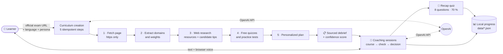

<div align="center">

# 🎓 My AI Certification Coach

**An AI tutor that turns any official exam page into a personalized study plan — by voice and by text.**

[English](README.md) · [Français](README.fr.md)

[](LICENSE)
[](https://nodejs.org)
[](https://platform.openai.com)
[](#-how-it-works)
[](#-key-features)
[](package.json)
[](#-contributing)
[](https://github.com/careerpmo-max/My-AI-Certification-Coach/actions/workflows/ci.yml)

</div>

---

Preparing a certification is slow, scattered across a dozen tabs, and impersonal.
**My AI Certification Coach** reads the official exam page you give it, extracts the domains and their weights, builds a plan around your level, then teaches each module in a conversation — typed or spoken.
You end up with a structured course, per-domain progress tracking, and recap quizzes, running entirely on your machine with a single OpenAI key.

## ✨ Key features

| | Feature | What it does |
|---|---|---|
| 🌐 | **Generic multi-certification engine** | Give it the official exam page URL (any public https page). It extracts domains and weights; every extracted domain must appear verbatim in the page. A built-in suggestion exists for Microsoft AI-103. |
| 🧾 | **Sourced debrief + confidence score** | A deterministic score out of 100, with the reasons (page read, date found, weights consistent, resources and tips found…) and the cited sources. Exam-dump sites are excluded on purpose. |
| 🧭 | **Level assessment and personalized plan** | Optional diagnostic (one question per domain + self-assessment, overconfidence detection). The plan follows the official weights; a deterministic fallback plan is used if the model output is invalid. |
| 📊 | **Progress per domain** | Progress circles per module, per-domain and weighted global progress, and a progress bar that never moves backwards. |
| 📝 | **Recap quiz per block** | 8 original exam-style questions (single and multiple choice), 70 % pass mark, gaps recorded when you miss. |
| ▶️ | **Exact session resume** | The coach remembers your position, phase, and open gaps ("Resuming: …" when you come back). |
| 🎙️ | **Voice + text at the same time** | Uses the browser's native Web Speech API: no voice tokens billed by OpenAI. Chrome, Edge or Safari. |
| 🧑‍🏫 | **3 coach personas** | **Lumen** (kind), **Vera** (demanding), **Eko** (energetic), each with its own voice settings. |
| 🌍 | **Training in 3 languages** | French, English, Spanish. The language is fixed per curriculum and drives the coach, quizzes, UI and voice. [Add another](docs/ADD_A_LANGUAGE.md). |
| 🔒 | **Local data** | Profile, API key, curricula and conversations are JSON files in `data/` on your machine. |
| 🩺 | **`doctor` command** | `npm run doctor` exercises every sensitive API call with your key and tells you what to fix. |
| 💸 | **Usage counter** | API calls, tokens and an estimated cost shown under the input box (indicative prices, overridable). |

## 🖼️ Preview

<!--
  Add screenshots to docs/screenshots/ and uncomment:

  
  
  
  
-->

> 📸 *Screenshots coming soon — placeholders in `docs/screenshots/` (home, curriculum creation, coaching workspace, recap quiz).*

### Architecture



## 🚀 Quick start

**1. Prerequisites** — [Node.js ≥ 22](https://nodejs.org) (CI runs Node 22 and 24 on Linux, macOS and Windows) and an [OpenAI API key](https://platform.openai.com/api-keys). There is **no `npm install`**: zero dependencies.

```sh
node --version   # v22.x or higher
```

**2. Clone**

```sh
git clone https://github.com/careerpmo-max/My-AI-Certification-Coach.git
cd My-AI-Certification-Coach
```

**3. Configure (optional)** — your API key is entered in the app's onboarding screen, so `.env` is only needed to change defaults or to run `npm run doctor` without onboarding. The app does not load `.env` by itself; use Node's `--env-file`:

```sh
cp .env.example .env        # then edit .env
node --env-file=.env src/server/index.js
```

**4. Run**

```sh
npm start                   # or ./start.sh (macOS/Linux) · start.bat (Windows)
```

Open <http://127.0.0.1:3210> (`start.sh` / `start.bat` open it for you). The server only listens on your machine.

> ℹ️ On first launch the app creates a **"Coach IA" desktop shortcut** (once, marker `data/.shortcut-done`). Set `COACH_NO_SHORTCUT=1` to skip it.

**5. Check your setup** (a few cents of API usage)

```sh
npm run doctor
```

**6. First session** — complete the onboarding (first name, API key, coach), choose **New curriculum**, paste the official exam page URL, pick the training language, then click **Start with the coach**.

## ⚙️ Configuration

All variables are optional. The OpenAI key is entered in the app.

| Variable | Required | Description | Default |
|---|---|---|---|
| `OPENAI_API_KEY` | No | Used only by `npm run doctor` (otherwise read from `data/secrets.json`) | — |
| `COACH_PORT` | No | Local port | `3210` |
| `COACH_DATA_DIR` | No | Folder for local data | `./data` |
| `COACH_TEXT_MODEL` | No | Model for coaching, diagnostic, plan and quizzes | `gpt-4.1` |
| `COACH_EXTRACT_MODEL` | No | Model for outline extraction | `gpt-4.1-mini` |
| `COACH_RESEARCH_MODEL` | No | Model for web-search research | `gpt-4.1` |
| `COACH_PRICING` | No | JSON override of the indicative pricing used by the usage counter | built-in prices |
| `COACH_OPENAI_BASE` | No | OpenAI API base URL | `https://api.openai.com/v1` |
| `COACH_NO_SHORTCUT` | No | `1` disables the automatic desktop shortcut | — |

## 🧠 How it works

Each module of the plan goes through the same three-phase loop:

| Phase | What the coach does |
|---|---|
| 📖 **Course** | A complete lesson covering every objective, with examples and analogies — no control questions, only a soft "is this clear so far?". |
| ❓ **Check** | 2–3 targeted questions at the end of the module; gaps are recorded. |
| 🧭 **Decision** | Explicit choice: move on to the next module, or revisit an unclear point from another angle. |

The current phase is saved, so a session resumes exactly where you stopped. Each block ends with an 8-question recap quiz; only the quiz validates a block. The coach updates your progress through server-validated tools (`set_module_status`, `record_gap`, `save_cursor`).

More detail: [docs/ARCHITECTURE.md](docs/ARCHITECTURE.md) (written in French) and [docs/REAL_KEY_TEST.md](docs/REAL_KEY_TEST.md).

## 🗺️ Roadmap

Ideas only — no commitments, no dates.

| Idea | Why |
|---|---|
| More built-in certifications | The catalog currently ships a single suggestion (AI-103). |
| Rendering of JavaScript-heavy exam pages | Such pages currently need the "paste the page content" fallback. |
| Speak-to-interrupt | The mic is off while the coach talks; interruption is via the ⏹ button or `Esc`. |
| Other model providers | Only OpenAI is supported today. |
| Progress export / import | Data lives in local JSON files with no built-in backup. |
| More languages | French, English and Spanish today; adding one touches 3 required files plus 2 optional ones. |

## 🤝 Contributing

Contributions are welcome. Open an issue to discuss a change, then a pull request. Before submitting:

```sh
npm run ci      # syntax/import check + full test suite (no network required)
```

## 📄 License

Released under the [MIT License](LICENSE).

## 👤 Author

Maintained by **careerpmo-max** — [My-AI-Certification-Coach](https://github.com/careerpmo-max/My-AI-Certification-Coach).

## 🔐 Security

- Your API key stays local: it is stored in `data/secrets.json` (restricted permissions) and is never sent back to the browser. The only outbound calls go to OpenAI and to the pages you provide or that web search consults.
- **Never commit your `.env` file** — it is git-ignored, as is `data/`.
- Your progress, conversations and profile stay on your machine in `data/`.
- The server binds to `127.0.0.1` only, checks `Host`/`Origin`, and refuses private or local URLs.
- Chrome and Edge send voice audio to their vendor's online speech service; this is a browser behavior, not this app's.
